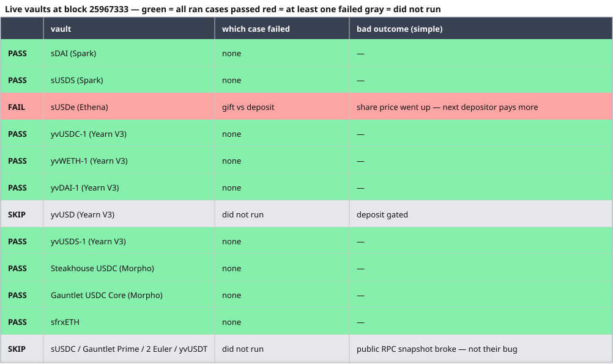
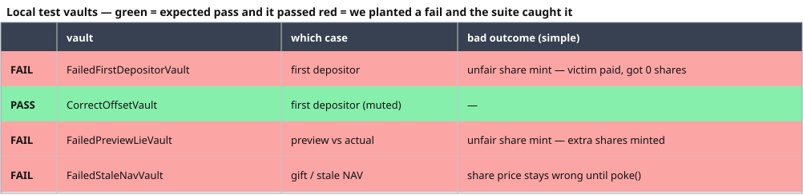

# ERC-4626 vault test report

**I measure 4626 pots. I don’t sell a cure.**

[](https://github.com/giladHaimov/erc4626-vault-test-report/actions/workflows/ci.yml)

I am not shipping a patched vault. OpenZeppelin already documented leftover-empty and donation. After the last share is gone you can get fewer new shares and still redeem about the same tokens. “The depositor was cheated / I fixed OZ” is the wrong claim. A senior asks who lost money. Often nobody did.

What still bites teams is **composability**: `preview*` vs the real call, a share price that jumps, a fee or oracle that treats that jump as yield. Sometimes the pot is not even in the vault — it sits in Aave-like helpers — and there is no honest on-chain “fix” for a number you do not control. So I do not sell a cure. I ship a **Foundry suite that measures a 4626 and writes a vault test report**.

This is **not an audit**. Not a patched vault. Not “exhaustive.” Not “the best route.”

## What it does

Two layers. Both write the same kind of report: facts first, then who is hurt.

**1. Local test vaults** (no RPC, no money). I deploy a few tiny vaults in Foundry. One is meant to pass the case I run (`Correct*`). The others are meant to fail a named case (`Failed*`). If the suite cannot catch a planted fail, the tool is broken. Forks are the demo. These vaults are the proof.

**2. Live snapshot** (RPC read only). Foundry copies Ethereum at one block onto my machine (`vm.createSelectFork`). I run the same cases against vaults that are already deployed (sDAI, Yearn, Morpho, sfrxETH, …). I do not deploy anything to mainnet. I do not pay gas. I do not empty a live pot.

Mocks exist so the local layer is cheap. The live layer exists because a mock cannot honestly fake Yearn strategies or Spark’s DSR pot.

## The cases (same list, both layers)

1. **Preview vs actual.** The spec is directional, not `==`. Deposit/redeem must give at least the preview. Mint/withdraw must not cost more than the preview. A live fail here is a spec break.
2. **Leftover empty.** Shares go to 0, tokens are still on the vault. Report share count, redeem value, whether price jumped. Live: not run (the pot is not empty; I will not drain it).
3. **Gift vs deposit.** Official `deposit`, then a plain `transfer` of the same token. If `totalAssets` or share price moves, they count gifts.
4. **First-depositor inflation.** Empty vault, tiny first deposit, large gift, victim deposits. Live: not run (same reason — pot is not empty).
5. **Helper gap.** `totalAssets` vs token balance on the vault. A static mismatch is usually architecture (DSR, strategies, markets). A gap that opens and closes over time would be the risk. One block cannot show that.

## How a row is colored

This is the rule. It is not optional.

- **Green** = every case we ran on that vault passed.
- **Red** = at least one case failed. The row says which case, and the bad outcome in one line (example: unfair share mint; next depositor pays more).
- **Gray** = we did not run the case.

GitHub’s README strips HTML background colors, so the table below is an image. The row itself is green or red.

## Live finding — block `25967333`

One red row: **sUSDe (Ethena)**.

- **Which case:** gift vs deposit.
- **What we did:** deposit, then send the same token in as a gift.
- **What happened:** share price went up.
- **Bad outcome:** the next depositor pays more for the same share.

We **record this as a failed case**. It is not a conclusive error. The vault team may want gifts to raise share price (existing holders gain). That can be a product choice. The report’s job is to show the price move, not to tell Ethena to change it.

Preview: no live vault we tested lied.

Empty-pot attacks (leftover / first depositor): not run. Those vaults already have deposits. We will not drain them.

Other vaults we could test: gift did not move price.

Five vaults we could not test (sUSDC, Gauntlet Prime, two Euler EVK, yvUSDT): the public RPC snapshot broke. That is our RPC, not their bug.

Full numbers: [`reports/live.md`](reports/live.md).



## Local test vaults (the proof the tool works)

These live in `src/test-vaults/`. The fake token is `src/mock/MockAsset.sol`. No RPC.

`Correct*` means: we expect the cases we run to pass.
`Failed*` means: we planted a fault and we expect that case to fail.

If a `Failed*` vault goes green, the suite is blind. If a `Correct*` vault goes red, we misnamed it or the case is wrong.

### `FailedFirstDepositorVault`

Plain OpenZeppelin 4626. Offset 0. No extra logic.

**How it fails.** Vault is empty. Attacker deposits 1 wei and gifts a large pile of tokens. Victim deposits a normal amount and gets **0 shares**. Attacker can redeem almost the whole pot.

**Bad outcome:** unfair share mint. Victim paid and got nothing.

Preview on this vault still matches. Gifts count. Leftover-empty is facts only (next depositor may receive leftover tokens).

### `CorrectOffsetVault`

Same OpenZeppelin vault, plus virtual shares (`_decimalsOffset() == 3`).

**What we expect.** The same first-depositor attack does **not** wipe the victim. They get shares and can redeem a real amount. Preview matches.

Not a claim that the vault is safe against every attack. Only that this wipeout is muted.

### `FailedPreviewLieVault`

OpenZeppelin 4626 whose `preview*` helpers lie versus `convertTo*`.

**How it fails.** `previewDeposit` promises more shares than `convertToShares`. OpenZeppelin `deposit()` follows `previewDeposit()`, so the lie is minted (about 1,210 shares on a 1,000-token deposit).

**Bad outcome:** unfair share mint. Existing holders are diluted.

### `FailedStaleNavVault`

OpenZeppelin 4626 with a cached `totalAssets`.

**How it fails.** A gift does not update the cache. Share price stays stale until someone calls `poke()`.

**Bad outcome:** anyone who reads `totalAssets` before poke sees the wrong share price.



Human write-up: [`reports/test-vaults.md`](reports/test-vaults.md).

## Live tests in more detail

Default path is a **mainnet snapshot at a pinned block**. One `createSelectFork` for the whole allowlist. The block number is stamped into [`reports/live.md`](reports/live.md).

I will not storage-zero a live pot and call that “the protocol can go empty.” Leftover-empty and first-depositor stay **not run** unless a vault is actually empty (none on this list).

Gift vs official add needs no source: `deposit()`, then `transfer` the same token. If price moves, they count gifts.

Live preview is **deposit**, plus redeem when it is not gated. The local suite checks all four preview functions. Live does not pretend mint/withdraw ran.

`totalAssets ≠ balanceOf(vault)` at one pin is architecture (DSR pot, Yearn debt, Morpho markets). I do not call that a helper lie.

A price jump alone is not a fee bug. I only name a fee/oracle victim if I show that path. I did not.

Allowlist: [`docs/live-allowlist.md`](docs/live-allowlist.md). Method: [`docs/METHOD.md`](docs/METHOD.md).


## Local tests vs live tests (plain)

Local tests answer: “Does the suite even work?” I know the answer in advance. `FailedFirstDepositorVault` must go red on first-depositor. `FailedPreviewLieVault` must go red on preview. `CorrectOffsetVault` must stay green on the wipeout we run. If that does not happen, I do not trust a live table.

Live tests answer: “What do real deployed vaults do at this block?” I do not know the answer in advance. A red row on a vault I did not write is the public demo. One red row is not a verdict that the protocol is broken.

That is why sUSDe is written up as a **failed case**, not a **conclusive error**. We saw a gift move the share price. The team may like that (existing holders gain). We still color the row red because the case failed the check we ran.

Gray is not a pass and not a fail. It means we did not run it. Do not read SKIP as “safe.”

## What a red row means (simple)

| Color | Meaning | What you should read next |
|---|---|---|
| Green | Every case we ran passed | Nothing failed. Empty-pot cases may still be untested (gray). |
| Red | At least one case failed | Which case + bad outcome. Then decide if that is a bug or a product choice. |
| Gray | We did not run it | No evidence either way. |

Examples of a bad outcome we will write in one line:

- unfair share mint — victim paid, got 0 shares
- unfair share mint — extra shares minted, existing holders diluted
- share price went up after a gift — next depositor pays more
- share price stays wrong until someone pokes the cache

We do **not** write “unfair share price” on leftover-empty just because fewer new shares were minted. Those shares can still redeem about the same tokens. If nobody lost money, we do not invent a victim.

## What I will not do

- Call this report an audit
- Headline “I fixed OpenZeppelin”
- Deploy a harness or a vault to Ethereum
- Empty a live pot to manufacture leftover-empty / first-depositor
- Mark a vault vulnerable/safe instead of who is hurt
- Treat a public-RPC snapshot flake as a vault bug
- Treat a gift-price move on a live vault as a conclusive error

## Open this, in order

1. This README
2. The two colored tables above
3. [`reports/test-vaults.md`](reports/test-vaults.md) (local, human)
4. [`reports/live.md`](reports/live.md) (live numbers)
5. `src/test-vaults/` (the demo vaults + comments)
6. `test/` (one file per case; live is `test/LiveFork.t.sol`)

## Run

```bash
# local test vaults — no RPC
rm -f reports/_generated.md
forge test --jobs 1 --no-match-path test/LiveFork.t.sol -vv

# live snapshot — RPC read only, no deploy
cp .env.example .env   # set MAINNET_RPC_URL; do not commit .env
set -a && source .env && set +a
rm -f reports/live.md
forge test --jobs 1 --match-path test/LiveFork.t.sol -vv
```

`--jobs 1` so report rows do not interleave. CI runs local test vaults only.

## License

MIT
